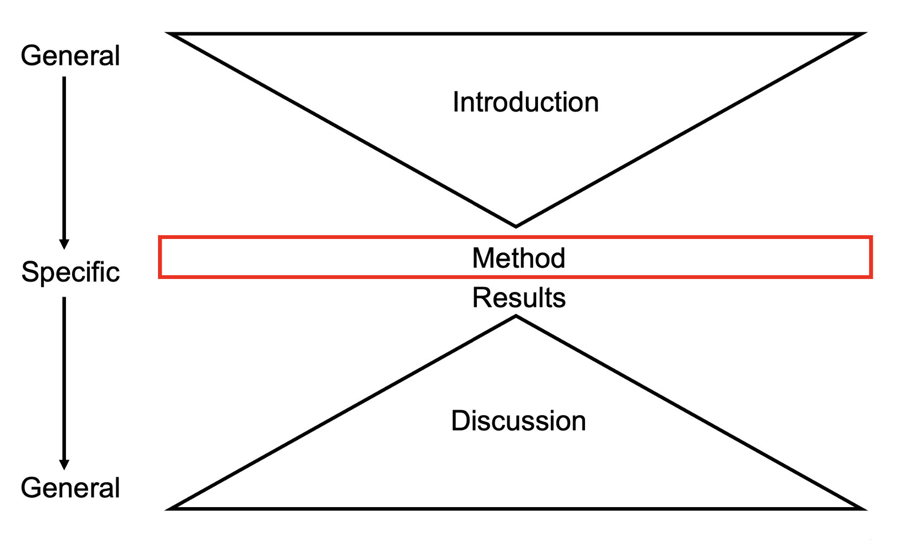

```{r, echo=FALSE}
source(file = "include/deadlines.R")

library(knitr)
```

# Structure of the Method {#05-Method}

In this chapter, you will learn about the method section, which is in the middle of the hourglass shape of a report (@fig-method). It is the first specific section which is exclusively about your study. 

```{r method highlight, echo=FALSE}
#| label: fig-method
#| fig.cap: "The method section highlighted as the focus of this chapter."
#| fig.alt: "Empirical report structure as an hourglass shape. In this part, the method is highlighted in red to show it is the focus of this chapter."


```

The method section is normally split into a series of subsections, each detailing different aspects of how you went about running your study. For your report, we recommend using the following subsections:

-   Participants

-   Materials

-   Procedure

-   Design and Data Analysis

As you read more journal articles, you might notice some additional sub-sections, a different order of presentation, or merging some of these sections into one. However, we encourage you to start by learning this method, so you can recognise the key information that should be included in the method section. 

For the course we wrote this book for, keep in mind you are writing a registered report, so there will be some details you will not know that you see included in a traditional report. For example, you will not know the final sample size, nor will you know precisely how you analysed the data. You can only report how you designed the study to constrain researcher degrees of freedom, not what the end product is. 

One element that might feel a little odd is you typically write the method section in past tense - describing how you *planned* your study - even when you have not conducted it yet. We do this as a published final registered report includes all the sections with the method and results in the middle, so it is presented as one longer piece of work for how you designed your study and then what results you found. We recommend retaining that style as we are helping you to prepare for writing a full research report, but for a Stage 1 submission, it would be acceptable to write in future tense for a study you have planned but not conducted yet. The important thing is being consistent in the approach you take and not switching between past and future tense. 

To see how the framing changes between a Stage 1 and Stage 2 report, you might find it useful to read the method section (pages 2 and 3) of [*Registered Replication Report: Testing Disruptive Effects of Irrelevant Speech on Visual-Spatial Working Memory*](https://jeps.efpsa.org/articles/10.5334/jeps.450){target="_blank"} by Kvetnaya (2018). If you compare that to Kvetnaya's original [stage 1 version online](https://osf.io/j4475){target="_blank"}, you can see how she framed the planned sample before the wording changed in the final article. Reinforcing our warning above, you will also notice the sub-sections in Kvetnaya (2018) are slightly different to what we recommend. 

## Participants

Normally, this would appear first in the method. The aim here is to explain who your sample were (or your planned sample in this scenario) and how you recruited them. You would normally include elements such as:

-   Method of recruitment

    -   Opportunity/convenience, volunteer, or random sampling? 

    -   How were they encouraged to take part? Was there any incentive?

-   Relevant demographic information

    -   What is relevant depends on what you are testing. This is about contextualising your sample to the reader.

    -   So, we tend to give an overall description of the sample and then we give a description relevant to what we are testing. However, if you are not testing any groups then you might not need this and you just need the overall view.

    -   However, it is not necessary to go into lots of detail about something like nationality or other demographics if you do not think it is relevant to the outcome of your study.

-   Any inclusion or exclusion criteria

    - Inclusion criteria are features you are looking for in your sample. 
    
    - Exclusion criteria are features that you would exclude people from your sample. 
    
    - These are not necessarily opposites, think of it as inclusion criteria are what would get people into your sample, and exclusion criteria are what would remove people from your sample once you recruited them. 

-   Think about the order that you present information within a section.

    -   Remember you are leading a reader through the methods, so it is important for them to be able to follow what you are saying. This means thinking about what they will know at certain points and what they will understand. Ask yourself, "will this make sense to a reader if I present this information now, or should I present it later/earlier?"

    -   For example, if you plan on excluding people and this changes the possible demographics of your groups, then it would make sense to present the demographics after you have presented the exclusion criteria, so it is clear the demographics are of those left in your study and do not include people you removed.

## Materials

This would normally come second in your method section and it covers the software and questionnaires in this study, or about any stimuli, questionnaires, software, and/or additional materials in other studies. Assume the reader knows nothing about the questionnaires and software here and you are trying to explain the materials to them so they can understand what they are and how you used them.

A well-written materials section should allow someone who was not part of the research team to replicate the study. You are trying to give them as much detail as possible that they could run your study, but sometimes longer details (such as a full list of questions) can be included in the appendix to save space in the main report. 

You would normally include aspects such as:

-   Demographic questions

    -   How many questions were there?

    -   What were the response options?

    -   Give an example of a question or two. It does not have to detail every question but you can summarise the main points.

    -   For example: "We asked {state number} demographic questions to establish age, nationality... with dropdown category options to respond to ... and free-response boxes to answer.."

    -   Again, think about what is relevant. Focus on detailing the demographics you are using for the analysis. If you are not using a demographic variable, then keep this just as a broad overview of the types of question you ask participants.

-   Any published, validated scales you gave to participants. 

    -   You should describe the overall purpose behind the scale and what construct it is trying to measure. 
    
    - State which subscale/s you will use data from if you are not using the whole thing. Remember from the measurement lecture though, it is not usually a good idea to chop validated scales up but you can use specific sub-scales if the others are less relevant. 

    -   The scale should have an APA citation and entry in the reference list to acknowledge it's source.

    -   Explain details like how many questions there were in total and how many questions are in your relevant subscale/s.

    -   What were the response options for the subscale/s?

    -   For example: "The help-seeking subscale is made up of 5 questions such as "example question" and "example question", with potential responses on a 5-point Likert scale where 1 means... and 5 means..."

- If your materials do not come from a validated scale, you need to explain and provide examples of what they looked like for participants. Depending on the length, you might provide a short extract or example, with the full materials available as an appendix item. 

-   You should also mention the software you (from your perspective as the researcher) used to host the study. For example, we used Qualtrics to host the two project studies. 

## Procedure

The procedure details what happened in the study. This section normally comes after the materials section as the reader needs to understand **what** you used before they can understand **how** you used them. It can take a while to recognise the distinction between the two sections as you are trying to avoid overlap wherever possible between the sections. Consider the materials as what participants completed and the procedure as when in the study they completed each component of the materials. 

The main point to keep in mind when writing this section is to think about reproducibility. After reading this sub-section, a reader should be able to reproduce your study exactly, based on what you have written in the materials and procedure.

You would normally include aspects such as:

-   What the participants did in the study, what order they did things in, how the study looked to them, and roughly how long it took them to complete.

-   Try to think about how the participant accessed the study. Remember you can access the materials on Moodle to remind yourself of any details of how participants worked through the study.

-   The procedure is typically where you outline the ethics processes, such as reading the information sheet and providing consent at the start, and reading the debrief at the end. You do not need to explain what information these documents contain, just when they read them and how the participants interacted with them. 

-   You can include the colour of font and background colour.

-   You explain the order participants completed the materials: did they do the demographics and then the scales, or vice versa? Did all participants complete the materials in the same order or was there any randomisation?

-   Were all the questions on one screen or did participants see one question at a time?

-   How did participants respond: did they use the mouse, did they use certain keys, did they speak their answer?

-   Did participants have a time limit to respond by or could they take as long as they want? What could participants do if they did not want to respond to a question?

If you find you are repeating a lot of information from the materials, then there is a good chance you are mixing up what information goes where. Remember: the materials is what you provided to participants, and the procedure is what order they received the materials in. The main goal here is to find a balance between providing enough detail for someone to replicate your study without taking up too much of the word count better spent elsewhere.

For example, you could reduce: "**Participants saw an advert on social media and then they clicked on the link and then they read the consent form and then if they decided they wanted to do the study they consented and then they started answering the questions**" 

To be more concise: "**Participants accessed the study through a link on social media. Before starting the study, participants read an information sheet and gave consent to taking part.**"

## Design and Data Analysis

This subsection usually comes last in the method to transition to the results. You focus on what **you** planned on doing with the data to link your research question/hypothesis, design, and statistical test.

Thinking about logical flow again, if you were to present this at the start of the method section, then it would not make much sense to the reader as they just do not know enough information about the study yet.

You would normally include details such as:

-   Your research design

    -   Is it within-subjects, between-subjects, correlational?

    -   If you have more than one analysis in your study, you present them all, either as one paragraph or separate paragraphs depending on the complexity.

-   Your dependent/measured variables

    -   If you are comparing groups/conditions, then it's better to talk about your dependent variable.

    -   If you are interested in a relationship/association, then it's better to talk about measured variables as there is no independent and dependent variable in a correlational design.

-   Where applicable, state the independent variable and it's levels (conditions or groups depending on your design) 

-   You could report a power analysis here to outline how many participants you estimated you need to detect your smallest effect size of interest. Alternatively, you see people report it in the participants section or you could report it at the start of your results section.

-   Briefly state how you planned on analysing the data 

    - You would state the type of test/model, use of R (with citations), and any relevant packages.
    
    - The idea here is to constrain those researcher degrees of freedom, so you are outlining how you plan on analysing the data to the best of your knowledge, so you can explain and justify any deviations from this plan in your stage two individual report. 

## Top tips on writing a good methods section

-   Method sections are quite formulaic and work by putting the right information in the right sections. Try to follow the guidance above on what goes where.

-   You **must** use sub-headings and we would highly recommend the sub-headings we have stated here.

-   Try to avoid repeating information across sections. If you find you are doing that, then it is likely that you are including information in the wrong sections. Each section has a different focus and it will be an important part of the editing process to identify and cut this out.

-   It's difficult to balance being concise but detailed enough that someone could replicate your work. It will take work in the editing process to consider what is essential and what you can cut, but try not to waste words in the method section on redundant details. Save words for building your narrative in the introduction and discussion sections.

-   Reading journal articles and focusing on the method section is a good way to see what information can go where. There is a lot of variation in published articles though and they are not often perfect examples, so another thing to think about when reading papers is "what is missing here that would allow me to replicate this study?"

## Manipulating examples of materials and procedure sections

To finish, we are going to manipulate elements of a materials and procedure section to help drive home some of the key points. Try to think about the questions and advice here when you look at your own materials and procedure sections, and see how you can generalise these key points to your participants and design and data analysis sections.

### Example 1: A procedure sub-section

This is the procedure section from [Tsantani et al. (2016)](https://journals.sagepub.com/doi/full/10.1177/0301006616643675){target="_blank"} which one of the team worked on. Although it's published, it does not mean it is a perfect example. You are always learning and you might look back at something you wrote and wonder why you did it like that in the first place. Read the paragraph, then look at the highlighted sections after.

> "The experiment took place in the experimental laboratories of the University of Glasgow. Participants were required to complete a 2AFC task during which they listened to pairs of voices comprising high- and low-pitched versions of the original recordings. The sound samples were presented through headphones (participants' own) connected to a computer with the sound set at approximately 80 dB Sound Pressure Level (SPL): System volume was measured prior to the experiment using a standard headphone set (Sennheisser Beyerdynamic DT 770 PRO 250 OHM) and sound meter. At the beginning of the experiment, participants were informed, via on-screen instructions, that they would hear pairs of voices in two blocks, by trait, and would be asked to make a decision regarding each pair. Participants were told that there was no time limit to their decision but were encouraged to answer with their first impression. After each pair of voices the question "Which voice did you perceive as more {dominant} {trustworthy}?" was displayed on the screen. Pressing the "s" key would mean that they perceived Voice 1 as being most dominant or trustworthy, whereas the "k" key represented Voice 2. The definitions of dominance and trustworthiness used in the instructions were "Dominance means having power and influence over others" and "Trustworthiness means able to be relied on as honest or truthful." The order of the dominance and trustworthiness blocks, as well as the order in which the voice trials were presented within the block, were counterbalanced across participants. Male and female trials were presented randomly within the same block, as opposed to being presented in different blocks, to avoid an additional potential block-order effect caused by the gender of the voice. Finally, the order of the high- and low-pitched versions of the recordings within each trial was counterbalanced by including two trials of each pair in a block, with the high- and low-pitched versions in a different order. Therefore, within each block, the 20 pairs of voice samples were presented twice. The voices within each pair were played consecutively with a 1-s pause between the first voice and the second voice, and participants proceeded to the next trial by pressing "space." The experiment lasted approximately 14 min."

#### Highlighted section 1

> "After each pair of voices the question "Which voice did you perceive as more {dominant} {trustworthy}?" was displayed on the screen. Pressing the "s" key would mean that they perceived Voice 1 as being most dominant or trustworthy, whereas the "k" key represented Voice 2."

-   This is clear on which keys participants had to use. This is quite specific detail, but clearly the authors had a reason for this. Normally, this will be because it helps reduce reaction times if you use specific keys and participants hold their fingers on those keys at all times.

-   However, it does not say whether they told participants to always have their fingers on those keys and whether participants could see this "key-mapping" (what key represents what answer) all the time, just at the start, or just at breaks. 

#### Highlighted section 2

> "The definitions of dominance and trustworthiness used in the instructions were "Dominance means having power and influence over others" and "Trustworthiness means able to be relied on as honest or truthful."

-   This is really clear on what the specific definitions were that participants were instructed to use but they do not state if these definitions were displayed throughout or just at the start. Would this make a difference if you tried to replicate the study? It might help to add one or two words to make it clear what actually happened.

#### Highlighted section 3

> "The order of the dominance and trustworthiness blocks, as well as the order in which the voice trials were presented within the block, were counterbalanced across participants."

-   Words like "counterbalanced" are technical terms to help clarify what happened but reduce the word count of a longer explanation. However, it is a bit unclear what it means in terms of "voice trials", so that might need further clarification.

#### Highlighted section 4

> "Finally, the order of the high- and low-pitched versions of the recordings within each trial was counterbalanced by including two trials of each pair in a block, with the high- and low-pitched versions in a different order. Therefore, within each block, the 20 pairs of voice samples were presented twice. The voices within each pair were played consecutively with a 1-s pause between the first voice and the second voice, and participants proceeded to the next trial by pressing "space."

-   This is getting rather complex and you could improve the explanation with an example (A vs B, B vs A) and the total number of trials (40). The main thing though is that it is trying to give enough detail for someone to replicate (1 second gap, press space etc.).

#### Highlighted section 5

> "The experiment lasted approximately 14 min."

-   It is always good to include the approximate time for participants to complete the study. If someone is replicating your study and their version takes 45 minutes, they know something is wrong.

### Example 2: A materials sub-section

This is adapted from the materials section of a first draft of a paper by Stuart McLaren and Phil McAleer in the department.

> "The Statistical Anxiety Rating Scale (STARS; Cruise et al., 1985) consists of 51 items comprised of two sections and six subscales. The first section includes 23 statements rated on a 5-point Likert scale that range from "1 = No Anxiety" to "5 = Strong Anxiety". This section addresses three factors related to how individuals experience specific statistical situations: (a) Test and Class Anxiety (8-items with scores that range from 8 to 40), (b) Interpretation Anxiety (11-items with scores that range from 11 to 55) and (c) Fear of Asking for Help (4-items with scores that range from 4 to 20). For instance, statements include "Doing an examination for a statistics course" or "Going to ask my statistics teacher for individual help with material I am having difficulty in understanding". The second section consists of 28 statements rated on a 5-point Likert scale that range from "1 = Strongly Disagree" to "5 = Strongly Agree". This section examines levels of attitudes towards scenarios that involve statistics and statistics teachers over three factors: (d) Worth of Statistics (16-items with scores that range from 16 to 80), (e) Fear of Statistic Teachers (5-items with scores that range from 5 to 25), and (f) Computational Self-Concept (7-items with scores that range from 7 to 35). For example, statements include "I wish the statistics requirement would be removed from my academic program" or "Statisticians are more number orientated than they are people orientated". A compound score of each subscale is calculated by summing item scores in each subscale, with higher scores indicating higher levels of statistics anxiety. The six subscales show good Cronbach's alpha reliabilities between .81 and .94 (Chew et al., 2018)."

#### Highlighted section 1

> "The Statistical Anxiety Rating Scale (STARS; Cruise et al., 1985) consists of 51 items comprised of two sections and six subscales."

- Although we may have stated this information earlier in the introduction, we are now in the method section and all that relevant information needs to be here.

#### Highlighted Section 2

> "The first section includes 23 statements rated on a 5-point Likert scale that range from "1 = No Anxiety" to "5 = Strong Anxiety".

- Note here that we are talking about the scales for how it looked but not how the participants responded. Think about what information goes where at all times. In addition, would it help if we stated whether or not the values 2, 3, and 4 had labels on them or not? It would at least help if we said they had no labels.

#### Highlighted Section 3

> "A compound score of each subscale is calculated by summing item scores in each subscale, with higher scores indicating higher levels of statistics anxiety."

-   This works here, but it could also appear in the data analysis subsection. The idea is that by the time you get to the results, you know what is happening with the scales and how they are calculated and interpreted. A key observation here is that there is not one perfect approach but often when you start to think about the logical flow of information, the better approach sticks out.

#### Highlighted Section 4

> "The six subscales show Cronbach's alpha reliabilities between .81 and .94 (Chew et al., 2018)."

-   Finally, we have not explored reliability of scales in much detail (briefly in lecture 2) but if you had that information from a previous paper, then it can be useful and helps give context to the scales to show they are valid and reliable. For one improvement, you could explain what the values mean for whether they suggest high or low reliability.
