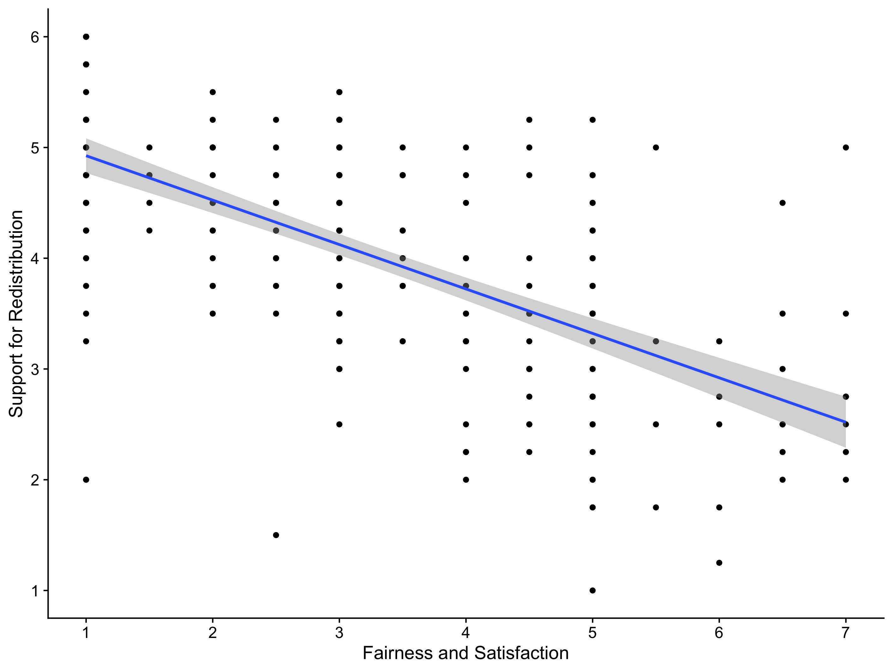
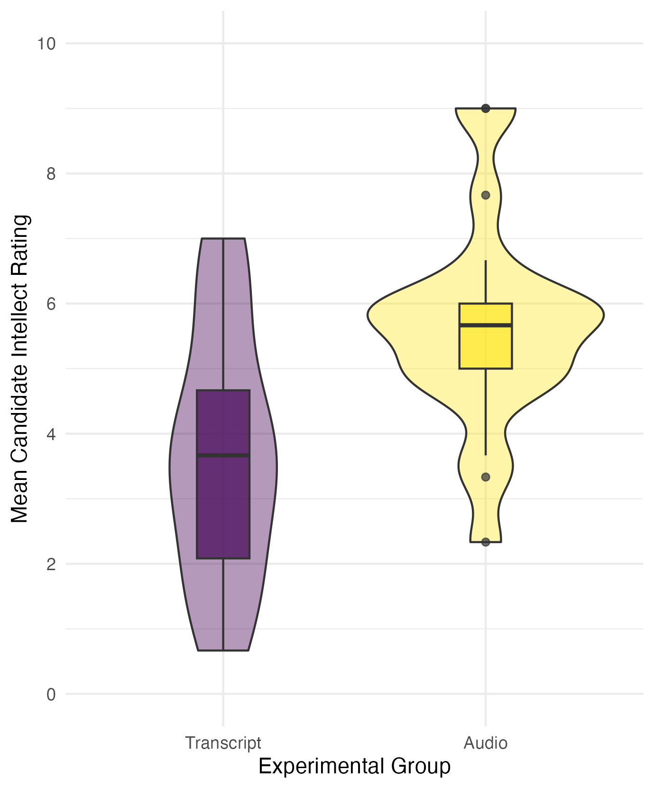

# Structure of the Results {#08-Results}

```{r C7 load packages, echo=FALSE, warning = FALSE, message=FALSE}
library(pwr)
library(tidyverse)
library(knitr)
```

In this chapter, we turn to the next major section of a report: the results section. This is still the narrow part of the report keeping the hourglass shape in mind as it's fully focused on your study and trying to explain to the reader what you found to address your research question.

The results section is reported in past tense as you are describing what you found. They are typically short sections - especially for standard statistical tests - consisting of approximately two or three paragraphs. This is not prescriptive as if you have deviations to justify or assumption checks to explain it can be longer, but think about whether you have provided all the information you need to rather than chasing a specific word count. 

To learn the key information that should be included in a results section, we recommend including six components. Unlike the method, these are not typically sub-sections with headings in your report, but components to make sure you include. The six components are: 

1. Restate your hypothesis from the stage one report (if applicable). 

2. Deviations from your stage one report.

3. Assumption checks.

4. Descriptive statistics.

5. Inferential statistics.

6. Statement on your hypothesis.

While we recommend using this order to start with, the key principle is maintaining logical flow. For example, you could start by outlining deviations from your Stage 1 report first before restating the hypothesis, but outlining your descriptive statistics after your inferential statistics would be confusing to the reader. 

## Restate your hypothesis from the Stage 1 report

Compared to your Stage 1 report, you might justify changing which statistical test is most appropriate, but your hypothesis should never change. You might no longer think it is a good idea or it could be expressed better, but that would be a lesson for the future. For your Stage 2 report, your hypothesis should be the exact same one as you predicted in your group for the Stage 1 report (if you had one in the first place). We promote initiatives like registered reports to avoid this kind of thing as changing your hypothesis risks HARKing - hypothesising after the results are known. 

Some things we recommend here you might not see in published articles. It's rare to see articles restate the hypothesis in the results section after already including it in the introduction, but just because published research could be presented better does not mean we want to reinforce bad habits. 

Restating the hypothesis helps the reader as they might not have remembered it from the introduction, so after reading the method, they might have to skip back to the introduction to remind themselves. So, restating the hypothesis reminds the reader and frames what you are testing in the results. 

::: {.callout-note}
Remember, a research question is essential, but a hypothesis is not. If your study was purely exploratory, it is perfectly legitimate for the aim of your study to simply explore a topic, providing it is labelled as such. Likewise, if you had a clear hypothesis in the introduction, then the aim of your study is more on the confirmatory side. Both are valid aims for a study, you just need to be honest about what the original aim of your study was.
:::

## Deviations from your Stage 1 report

The idea behind outlining your plans ahead of time through the registered report format or pre-registering a study is to avoid changing what you planned on doing and intentionally or unintentionally rationalising it after the fact. We know from meta-scientific research (refer back to lecture 1) that changing how you plan on processing and analysing your data can lead to more Type I errors, so we encourage you to be transparent about what you planned and what you actually did. 

You can still change you mind, there is a common phrase "[its a plan, not a prison](https://www.cos.io/blog/preregistration-plan-not-prison){target="_blank"}. However, outlining your plan ahead of time means you can stick to it if you still think your plan is appropriate, or you are forced to explain and justify changes to your plan. If you have no deviations to note and you approached the data analysis in the same way you outlined in the Stage 1 report, then you **do not** need this section. 

For communication, avoid referring readers back to the Stage 1 report as a means to cut words. Instead of saying "we changed our exclusion criteria (see Stage 1 report)...", include the relevant details in the text as one extra sentence could help communication for the reader to understand and avoid having to search for further details to understand your study. 

## Assumption checks

This is a component we want to see from you but it is exceptionally rare to see in published articles. When there are strict word counts, this is something people see as expendable, particularly if all the assumption checks past, so it is rare to see unless the authors had to deal with a specific problem. 

When we use statistical tests, they make assumptions about the data you are putting into them to behave as intended and give you accurate inferences. This content can be quite short, but we want to see which assumptions you tested, how you tested them, and what the outcome was. 

::: {.callout-important}
You need to explain which assumptions you checked, how you checked them, and whether they passed the checks, but you **do not** need to provide long explanations of what the assumptions are. You are working to a word count, so you can assume the reader knows what the assumptions are, you are just telling them whether you consider them to hold or not. 
:::

For example, if you intended to perform a Pearson's correlation or simple linear regression, you would check for normality of residuals, interval-level data, linearity, and homoscedasticity. You would outline how you checked these, such as looking at diagnosti plots, and whether you still think using a parametric test like Pearson's is appropriate. 

::: {.callout-note}
You check most of the assumptions using diagnostic plots and your own interpretation, so often there is no black and white answer. It is a judgement call that you must be able to explain and justify. The assumptions will never be perfect, so it is not about talking yourself out of using a parametric test, just checking it would be appropriate to use. 
:::

For checks that involve diagnostic plots, these are **not** typically included in the main text. It would take up a lot of space, so you add them to an appendix section and after explaining what you checked and what you conclude, refer the reader to the appendix if they want to look at the diagnostic plots themselves. 

This section ties into any deviations from the Stage 1 report. In the design and data analysis sub-section, you will have explained what statistical test you planned on using. You did not have the data at that point, so it was only your plan. If you checked the assumptions and that test would no longer be appropriate, you can change it, but you need to explain it is a deviation.

## Descriptive statistics

Descriptive statistics are summaries of your variables to help explain the context of your study and outline initial trends. For example, the mean and standard deviation (or median and interquartile range) of your variables to summarise how participants responded. 

::: {.callout-warning}
You can describe general trends from your descriptive statistics to add narrative for the reader, but in isolation, they do not support or reject a hypothesis. Only the inferential statistics support or reject a hypothesis. All you can talk about at this point is whether the pattern is consistent with what you expected or not. 
:::

### Descriptive statistics for correlations / continuous predictors

In the context of correlations or regression with a continuous predictor, it is normally useful to provide the mean and standard deviation (or median and interquartile range) of your variables. This helps to see how your participants responded to the variables and you could compare how your sample compared to the norms of the scale once you get to the discussion if this is something worth talking about. 

**APA formatting**

There are a few guiding principles here which the APA style website covers in a [short numbers and statistics guide](https://apastyle.apa.org/instructional-aids/numbers-statistics-guide.pdf). 

Means and standard deviations are typically reported to two decimal places. If the number can be larger than 1, then you include a leading zero (e.g., 0.34). but numbers than cannot be larger than 1 exclude a leading zero (e.g., .34). Use the symbol or abbreviation for statistics if there is a mathematical operator (e.g, *M* = 6.82, *SD* = 1.25), where the symbol is in italics. However, if you use the term in the main text, then you write it in full rather than the symbol (e.g., "the mean help-seeking rating was 6.82 (*SD* = 1.25)").

You can include tables to help report descriptive statistics when there is a lot of information to present and you want to show the values for many variables. For this course and assignment, you almost certainly do not need a table as there is not enough information to present when you only have two variables. On the other hand, figures are always useful to show a plot of your data. For a correlation, this is typically a scatterplot showing the relationship between your two variables. 

We dedicate [the next chapter - Data Visualisation](#visualisation) - to guidance on formatting tables and figures in APA style.

### Descriptive statistics for t-test / categorical predictors 

In the context of t-tests and regression with a categorical predictor, it is normally useful to provide the mean and standard deviation (or median and interquartile range) of your groups. This helps to see how your participants responded and whether the initial differences are consistent with what you expected, such as whether one group scored higher on average than the second group. 

You can include tables to help report descriptive statistics when there is a lot of information to present and you want to show the values for many variables or groups. On the other hand, figures are always useful to show a plot of your data. For a t-test, this is typically a violin-boxplot to show the difference and distribution of data between your two groups.

## Inferential statistics

After presenting your descriptive statistics, you can present your inferential statistical tests to see if you can support or reject your hypothesis. Statistical tests have a standardised format in APA style to ensure you report the key information and readers can easily find what they are looking for. 

### Correlations and continuous predictors

If you report a correlation, the individual tests have standardised formatting. 

**Pearson's r**

Pearson's r should be reported as follows: *r* (303) = -.70, 95% CI = [-.75, -.64], *p* < .001.

To break down each component: 

- *r*: Symbol for the test statistic in italics

- (303): Degrees of freedom

- -.70: *r* value reported to 2 decimals with no leading zero

- 95% CI = [-.75, -.64]: 95% confidence interval in square brackets to provide the interval estimation

- *p* < .001: *p*-values reported to three decimals, where *p*-values smaller than .001 are reported as *p* < .001, and p-values larger than .001 are written exact, e.g., *p* = .023. 

**Spearman's rho**

Spearman's rho is almost identical, but you include a subscript to distinguish it from Pearson's r: $r_s$ (303) = -.68, 95% CI = [-.74, -.61], *p* < .001.”

- $r_s$: Symbol for the test statistic in italics (here with a subscript to identify it as Spearman’s)

- (303): Degrees of freedom

- -.68: *r* value reported to 2 decimals with no leading zero

- 95% CI = [-.75, -.61]: 95% confidence interval in square brackets to provide the interval estimation

- *p* < .001: *p*-values reported to three decimals, where *p*-values smaller than .001 are reported as *p* < .001, and p-values larger than .001 are written exact, e.g., *p* = .023. 

When describing the results of your statistical test in words, remember to mention whether it is statistically significant or not, and the size and direction of the effect size. For example, 

> Using a two-tailed Pearson’s correlation, we found a large significant negative correlation between perceived fairness and satisfaction and support for wealth redistribution, *r* (303) = -.70, 95% CI = [-.75, -.64], *p* < .001.

We explain we used a two-tailed test, we used Pearson's r as the statistical test, it is described as significant to conclude we rejected the null hypothesis, and it is a large negative correlation to comment on the strength and direction of the effect. 

::: {.callout-warning}
Remember in the null hypothesis significance testing framework, we use it to help us make decisions. It has it's limitations, but it's designed to control error rates in correctly rejecting the null hypothesis or not. You can either conclude it is statistically significant or not statistically significant for a given alpha. You **do not** describe it as insignificant, and it **is not** consistent with the philosophy to try and spin a result as "marginally significant". 
:::

### t-tests and categorical predictors

If you report a t-test, the individual tests have standardised formatting. 

**Student or Welch's t-test**

A t-test should be reported as follows: *t* (33.43) = -3.48, , *p* = .001, Cohen's d = 1.13, 95% CI = [0.45, 1.81].

To break down each component: 

- *t*: Symbol for the test statistic in italics. 

- (33.43): Degrees of freedom which will be a whole number for a Student t-test (e.g., 34) but a decimal for a Welch's t-test (e.g., 33.43). 

- -3.48: *t* value reported to 2 decimals with a leading zero if applicable, including whether it is positive or negative.

- *p* = .001: *p*-values reported to three decimals, where *p*-values smaller than .001 are reported as *p* < .001, and *p*-values larger than .001 are written exact, e.g., *p* = .023.

- Cohen's d = 1.12: Your standardised or unstandardised effect size estimate, here the standardised mean difference between groups known as Cohen's d. Reported to two decimals with a leading zero since it can be greater than 1.  

- 95% CI = [0.43, 1.81]: 95% confidence interval in square brackets to provide the interval estimation for the effect size you report. 

::: {.callout-note}
Does it matter if my t-value or effect size is positive or negative? No, it's the absolute number which shows the size of the effect for a t-test. Both the t-value and effect sizes use group 1 minus group 2 in their equations. So, if group 1 is bigger than group 2, the t-value and effect size will be positive, and if group 2 is bigger than group 1, the t-value and effect size will be negative. The important thing is just be consistent, so if you report a positive t-value, the effect size should also be expressed as a positive difference. 
:::

::: {.callout-warning}
Remember in the null hypothesis significance testing framework, we use it to help us make decisions. It has it's limitations, but it's designed to control error rates in correctly rejecting the null hypothesis or not. You can either conclude it is statistically significant or not statistically significant for a given alpha. You **do not** describe it as insignificant, and it **is not** consistent with the philosophy to try and spin a result as "marginally significant". 
:::

## Statement on your hypothesis

Now you have presented the results of your inferential statistics, the final component comments on what it means for your hypothesis. Did it support your prediction or not? This is not meant to be a full exploration, you will have the discussion section for that next, you are just stating whether the results supported your hypothesis or not. 

## Bringing it all together

For statistical tests like correlations, t-tests, and simple linear regression, the results section will not be very long. We want you to focus on outlining the key information and interpretation, rather than adding unnecessary words. We can summarise the final three components in a short paragraph for both a correlation and t-test context. 

### Correlations / continuous predictors

> The mean fairness and satisfaction rating was 3.54 (*SD* = 2.02) and the mean support for wealth redistribution was 3.91 (*SD* = 1.15). Figure 1 provides a scatterplot showing a negative relationship between the two variables. Using a two-tailed Pearson’s correlation, we found a large significant negative correlation between perceived fairness and satisfaction and support for wealth redistribution, *r* (303) = .-70, 95% CI = [-.75, -.64], *p* < .001. This supports our hypothesis that there would be a relationship between perceived fairness and satisfaction and attitudes on wealth redistribution, suggesting that higher levels of support for wealth redistribution are associated with lower levels of perceived fairness and satisfaction of the current system. 

> *Figure 1* 

> Scatterplot showing a negative relationship between support for wealth redistribution and perceived fairness and satisfaction of the current system. 

```{r redistribution scatterplot, fig.alt = "Scatterplot for the negative relationship between support for redistribution and fairness and satisfaction of the current system.", echo=FALSE}

```

### t-tests / categorical predictors

> The mean candidate intellect rating was 5.63 (*SD* = 1.91) in the audio group and the mean rating in the transcript group was 3.65 (*SD* = 1.61). Figure 1 provides a violin-boxplot showing the difference between the two groups. We found recruiters who listened to an audio recording rated the candidate's intellect as 1.99 units higher (95% CI = [0.83, 3.15]) than recruiters who read a transcript, where a two-tailed Welch's t-test was statistically significant, *t* (33.43) = 3.48, *p* = .001, Cohen's d = 1.12, 95% CI = [0.43, 1.81]. This supports our hypothesis that there would be a difference in intellect ratings between recruiters who hear an audio recording or read a transcript. 

> *Figure 1* 

> A violin-boxplot showing higher candidate intellect ratings in the audio group compared to the transcript group.

```{r Schroeder research skills violin, echo=FALSE, fig.alt = "A violin-boxplot showing higher candidate intellect ratings in the audio group compared to the transcript group."}

```

::: {.callout-note}
Should I report the mean difference or Cohen's d for the standardised mean difference? There are different arguments around which effect sizes are most useful, so there is nothing wrong with reporting both if you have the space. Unstandardised effects are easier to understand and in the original units of measurement, meaning it is easier to compare between similar studies. Standardised effect sizes can - in theory - be used to compare effects from different measure and are useful for future power analyses, so it can be useful for the reader to report both. If you need to report just one, think which one will be most useful when it comes to putting your effect size in context in the discussion. 
:::

As a parting note, remember we outline these six key components to help you present the key information and inferences to your reader, but there is no one single correct way of presenting the information. The previous paragraph was only an example, and providing you include the key information with appropriate APA formatting and maintain logical flow, there are equally valid ways of presenting your results. 
